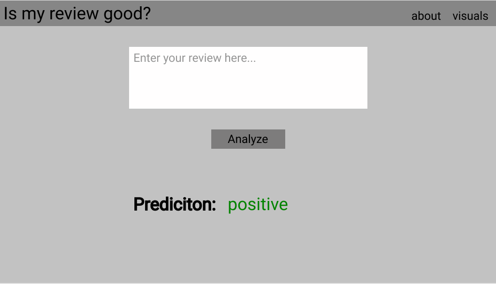

# Final Project

## Goal

Allow a user to enter a custom review and predict whether it is negative or positive.

## Technologies used

- AWS buckets
- Flask
- Heroku
- sklearn
- VADER
- Jupyter Notebooks
- HTML/CSS
- JavaScript

## Overview

Our data will be stored in a S3 bucket via AWS. With that data, we will train a model to make our predictions.  To accomplish this we will be using Google Colaboratory and PySpark's natural language processing, combined with a NaiveBayes model.  After saving the model (.h5), we will implement that model, along with a webpage, into a flask app.
Finally, we will host that app using Heroku so it will be publicly accessible. Once hosted, a user can enter their own review,and using the model we created, a prediction will be presented determining whether the review is a positive one, or a negative one.

***Datasource***: https://www.kaggle.com/lakshmi25npathi/imdb-dataset-of-50k-movie-reviews

### Framework

1. Front End
    - HTML/CSS/BOOTSTRAP
    - JavaScript
2. Back End
    - Flask
3. Preperation
    - AWS
    - PySpark

## Model Improvement

- Sentiment Analysis

## Visualizations (Work On Last)

- Word cloud with most common words for positive/negative respectivley

## Webpage

Here is a ***very rough*** idea of what the end result will look like.
The about page will have a description of how we setup the model and how it works
The visuals page (time permitting) will include some analysis such as most frequent words or review length

